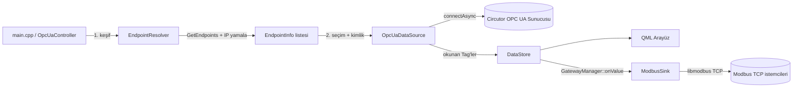

<h1 align="center">🔌 JarvisIoT — OPC UA İstemcisi</h1>

<p align="center">
  <em>Circutor PowerStudio sunucularına asenkron bağlanan, şifreli OPC UA istemcisi.</em><br>
  Konsol + Qt/QML arayüzü, otomatik endpoint keşfi ve IP yamalama ile.
</p>

<p align="center">
  
  
  
  
  
  
</p>

---

## 📖 İçindekiler

- [Özellikler](#-özellikler)
- [Mimari](#-mimari)
- [Gereksinimler](#-gereksinimler)
- [Kurulum & Derleme](#-kurulum--derleme)
- [Sertifika Üretimi](#-sertifika-üretimi)
- [Çalıştırma](#-çalıştırma)
- [Proje Yapısı](#-proje-yapısı)
- [Sorun Giderme](#-sorun-giderme)

---

## ✨ Özellikler

| | Özellik | Açıklama |
|---|---|---|
| ⚡ | **Asenkron bağlantı** | `UA_Client_connectAsync` ile bloklamayan el sıkışma; kopmada 3 sn'de bir otomatik yeniden bağlanma. |
| 🔍 | **Endpoint keşfi** | Sunucudaki tüm kapıları (`GetEndpoints`) listeler; güvenlik modu/politika bilgisiyle sunar. |
| 🩹 | **IP yamalama** | Sunucunun kendini `opc.tcp://Otomasyon:...` gibi hostname ile ilan ettiği durumda gerçek IP ile değiştirir. |
| 🔐 | **Şifreleme** | OpenSSL tabanlı `Basic128Rsa15` / `Basic256` / `Basic256Sha256` politikaları. |
| 👤 | **Esnek kimlik** | Anonim ya da kullanıcı adı/şifre; parola sunucu politikasıyla şifrelenir. |
| 🖥️ | **Qt/QML arayüz** | Tek executable (`OPC`) — Qt/QML GUI; motor kendi worker thread'inde döner. |
| 🧭 | **`[IP]` log yapısı** | Bağlantı öncesi hedef IP + endpoint özeti terminale basılır. |
| 🔁 | **Modbus TCP çıkışı** | Okunan tag'leri GUI'den başlatılan bir Modbus TCP sunucusu (`libmodbus`) üzerinden yayınlar; her tag için format (UINT16…DOUBLE, word/byte-order varyantları) ve register adresi eşlenebilir. |
| 🪟 | **Rotasyonlu abonelik** | Sunucunun paylaşımlı ~72 değer bütçesini aşmamak için tag'ler sabit boyutlu pencerelerde sırayla abone edilir (bkz. `ARCHITECTURE.md` §9). |

---

## 🏗 Mimari



Katmanlar `IDataSource`/`IDataSink` arayüzleri üzerinden gevşek bağlıdır; GUI (`OpcUaController`)
`GatewayManager`'ı (kaynak + `DataStore` + isimli sink'ler) gözlemler. `main` yalnız somut tipleri
kurup enjekte eder (composition root); QML bootstrap/selftest `GuiApp`/`GuiSelfTest`'te. Tam thread
modeli ve sunucu-bütçe kısıtı için `ARCHITECTURE.md` §4/§9.

---

## 📦 Gereksinimler

- **CMake** ≥ 3.15 ve bir C++17 derleyici (Clang/GCC)
- **OpenSSL** (şifreleme için — `brew install openssl`)
- **libmodbus** (Modbus TCP çıkışı için **zorunlu**, pkg-config üzerinden aranır —
  `brew install libmodbus`; kurulu değilse `cmake -S . -B build` adımı hemen başarısız olur)
- **İnternet** (ilk derlemede `open62541` FetchContent ile indirilir)
- **Qt6** (zorunlu — arayüz QML tabanlı; `brew install qt`)

> [!NOTE]
> `open62541 v1.3.11` derleme sırasında otomatik indirilir; elle kurmana gerek yok.
> Qt6 ve libmodbus kurulu olmalı; tek executable (`OPC`) QML arayüzüdür.

---

## 🚀 Kurulum & Derleme

```bash
git clone https://github.com/<KULLANICI_ADIN>/OPC.git
cd OPC

cmake -S . -B build
cmake --build build
```

Üretilen binary: `build/OPC` (Qt/QML arayüz).

---

## 🔐 Sertifika Üretimi

> [!IMPORTANT]
> Özel anahtarlar repoya **dahil değildir** (`.gitignore`). Şifreli bağlantı veya
> parolalı giriş için sertifikanı **yerelde bir kez** üretmelisin.

```bash
cd certs
zsh generate_certs.sh
```

Bu komut `certs/` altında şunları üretir (hepsi git tarafından yok sayılır):

| Dosya | Ne | Paylaşılır mı? |
|---|---|---|
| `client_cert.der` / `.pem` | Genel sertifika | Evet |
| `client_key.der` / `.pem`  | **Özel anahtar** | ❌ Asla |

---

## ▶️ Çalıştırma

### GUI

```bash
./build/OPC
```

Pencere açılır: **Ara** ile kapıları listele, bir kapı seç, kimlik gir ve **Baglan**.
Bağlanınca adres uzayı ağacında gez; bir yaprağa (Variable) tıklayınca abone olur ve
değeri **Canlı Değerler** panelinde akmaya başlar ("Cikar" ile abonelikten çık).

### Selftest (başsız doğrulama / CI)

```bash
QT_QPA_PLATFORM=offscreen ./build/OPC --selftest <url> <index> <saniye> [kullanici] [sifre]
```

### Teşhis script'i (ağ + bağlantı testi)

```bash
zsh diag.sh                 # sadece endpoint listesi
zsh diag.sh 3 admin 1234    # index 3'e kullanıcı/şifre ile bağlan
```

---

## 🗂 Proje Yapısı

```
OPC/
├── CMakeLists.txt          # FetchContent(open62541) + tek OPC (GUI) hedefi
├── certs/
│   ├── cert.cnf            # sertifika konfigürasyonu
│   └── generate_certs.sh   # anahtar + sertifika üretici
├── src/
│   ├── core/               # DataStore, Tag, EndpointInfo, IDataSource, GatewayManager
│   ├── source/             # EndpointResolver (keşif/IP) + OpcUaDataSource (bağlantı/browse/subscribe)
│   │                       # + OpcUaSubscriber (rotasyonlu abonelik, bkz. ARCHITECTURE.md §9)
│   ├── sink/               # ModbusConverter + ModbusSink (libmodbus tabanlı Modbus TCP çıkışı)
│   ├── qt/                 # OpcUaController + GuiApp/GuiSelfTest + QML arayüz
│   └── main.cpp            # composition root (GUI giriş noktası, DI)
├── tools/                  # opcua_mock_server.py, modbus_mock_master.py, monitor_resources.py
└── diag.sh                 # ağ/bağlantı teşhis script'i
```

Detaylı mimari, thread modeli, sunucu bütçe kısıtı ve performans analizi için `ARCHITECTURE.md`'ye bakın.

---

## 🛠 Sorun Giderme

<details>
<summary><strong>Bağlantı <code>BadIdentityTokenInvalid</code> / <code>Rejected</code> veriyor</strong></summary>

Seçtiğin endpoint anonim girişi kabul etmiyor olabilir. Kullanıcı adı/şifre ile
dene. Bazı sunucular (Circutor) şifresiz kapıda bile parolanın bir güvenlik
politikasıyla şifrelenmesini ister — bunun için sertifikaların üretilmiş olması gerekir.
</details>

<details>
<summary><strong>Logda <code>opc.tcp://Otomasyon:...</code> görüyorum, IP değil</strong></summary>

"Otomasyon" sunucunun kendini ilan ettiği hostname'dir; open62541'in iç logudur.
Gerçek TCP hedefini görmek için <code>[IP] CONNECT</code> ve
<code>BAGLANTI ONCESI HEDEF</code> bloğundaki IP satırına bak — orada IP görüyorsan
bağlantı doğru adrese gidiyordur.
</details>

<details>
<summary><strong>VSCode'da <code>#include &lt;open62541/...&gt;</code> altı kırmızı</strong></summary>

IntelliSense <code>build/compile_commands.json</code>'ı okur. `cmake -S . -B build`
çalıştırdıktan sonra <em>"C/C++: Reset IntelliSense Database"</em> veya pencere
yeniden yükle.
</details>

<details>
<summary><strong>Sertifika dosyaları bulunamadı hatası</strong></summary>

`cd certs && zsh generate_certs.sh` ile üret. Binary, derleme zamanında sabitlenen
mutlak <code>certs/</code> yolundan yükler (çalışma dizininden bağımsız).
</details>

---

<p align="center"><sub>JarvisIoT · open62541 ile ❤️ ile geliştirildi</sub></p>

Katkılarından dolayı Yaman Tevfik Tan,Selin Çiftçi ve Melih Mete Cop'a teşekkür ederim.
